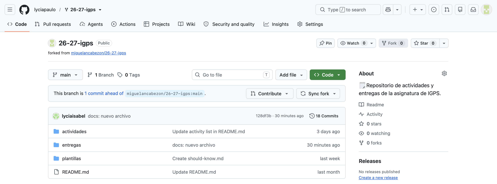
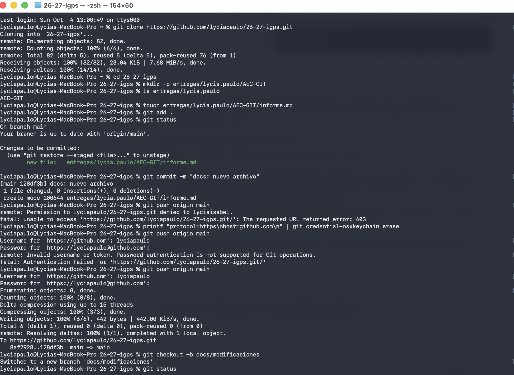
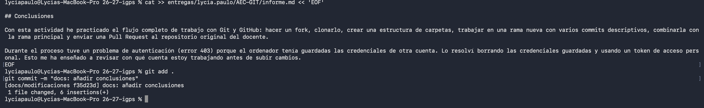
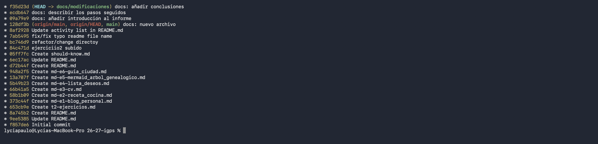
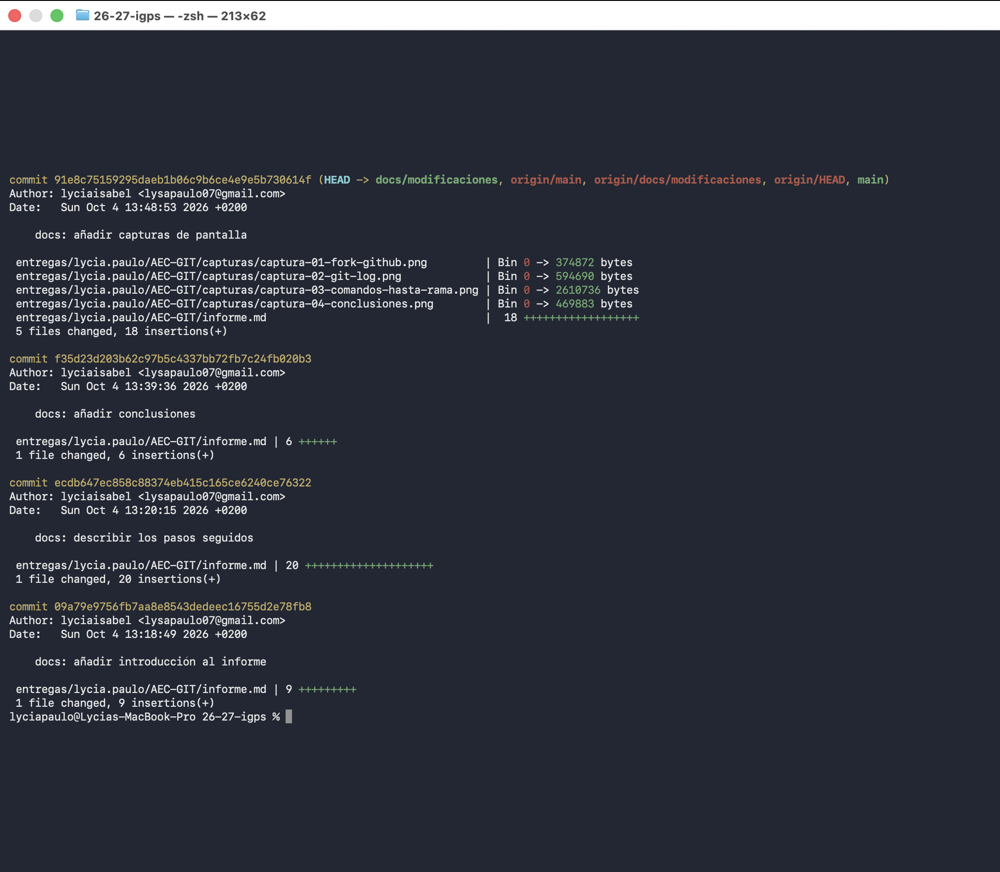
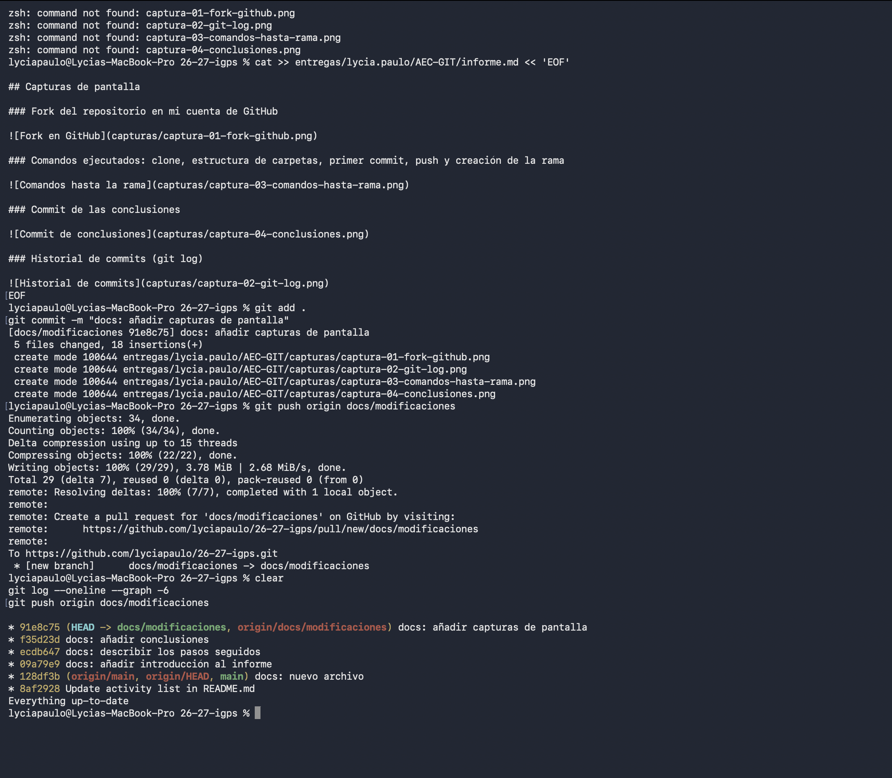
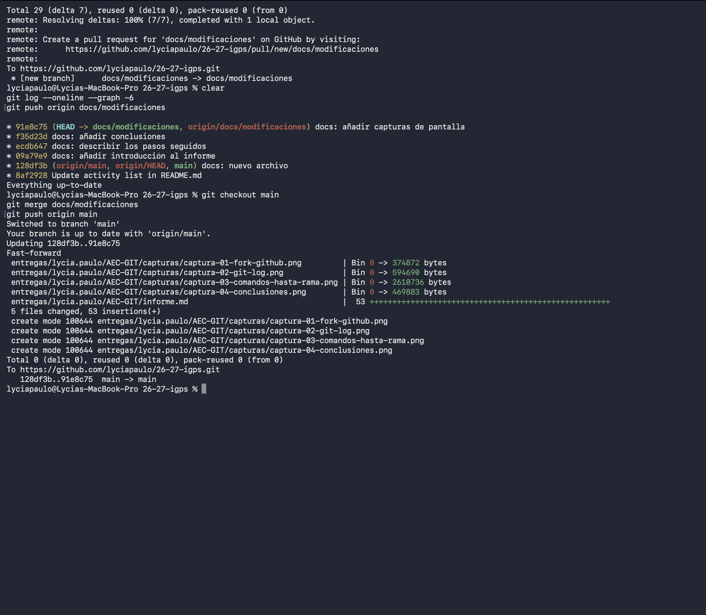

# Actividad de Evaluación Continua - GIT

**Alumna:** Lycia Paulo
**Asignatura:** Introducción a la Gestión de Proyectos de Software (IGPS)
**Repositorio:** 26-27-igps

## Introducción

En esta actividad he practicado los flujos básicos de Git: fork, ramas, commits y pull requests. Este documento recoge, paso a paso, el proceso que he seguido, junto con las capturas de pantalla de cada comando ejecutado en la terminal y de las acciones relevantes en GitHub.

## Descripción de los pasos seguidos

### Paso 1: Obtener mi propia copia del repositorio

Hice un fork del repositorio original del docente (`miguelancabezon/26-27-igps`) desde GitHub, con el botón "Fork". Después cloné mi fork en el ordenador con `git clone https://github.com/lyciapaulo/26-27-igps.git` y entré en la carpeta con `cd 26-27-igps`.

### Paso 2: Crear la estructura de carpetas inicial

Creé la carpeta `entregas/lycia.paulo/AEC-GIT` con `mkdir -p entregas/lycia.paulo/AEC-GIT` y comprobé que existía con `ls entregas/lycia.paulo`.

### Paso 3: Primer commit y subida inicial

Creé el archivo `informe.md` con `touch`, lo añadí al área de staging con `git add .` y comprobé el estado con `git status`. Hice el commit con el mensaje exacto "docs: nuevo archivo" y lo subí con `git push origin main`.

Al principio el push fue rechazado (error 403) porque el ordenador tenía guardadas las credenciales de otra cuenta de GitHub. Borré las credenciales guardadas y volví a autenticarme con mi usuario y un token de acceso personal, y entonces el push funcionó.

### Paso 4: Trabajar en una rama nueva

Creé la rama `docs/modificaciones` con `git checkout -b docs/modificaciones`. En esta rama edité `informe.md` y realicé varios commits descriptivos.

## Conclusiones

Con esta actividad he practicado el flujo completo de trabajo con Git y GitHub: hacer un fork, clonarlo, crear una estructura de carpetas, trabajar en una rama nueva con varios commits descriptivos, combinarla con la rama principal y enviar una Pull Request al repositorio original del docente.

Durante el proceso tuve un problema de autenticación (error 403) porque el ordenador tenía guardadas las credenciales de otra cuenta. Lo resolví borrando las credenciales guardadas y usando un token de acceso personal. Esto me ha enseñado a revisar con qué cuenta estoy trabajando antes de subir cambios.

## Capturas de pantalla

### Fork del repositorio en mi cuenta de GitHub

### Comandos ejecutados: clone, estructura de carpetas, primer commit, push y creación de la rama

### Commit de las conclusiones

### Historial de commits (git log)

### Detalle de los commits de la rama (git log --stat)

### Subida de la rama docs/modificaciones a mi fork

### Merge en main y subida de main

